
<!-- _class: lead gaia -->

# Space-Time Diagram

应物T2101 韩耀辉

---

# Content

1. Minkowski Diagram
2. World Line
3. Lorentz Transformation
4. Space-Time Interval
5. Proper Time
6. Twin Paradox

---

## Introduction

时空图主要分为两类：**闵可夫斯基图**和**彭罗斯图**。他们分别对应狭义相对论和广义相对论中的时空图。本次主要介绍闵可夫斯基时空图，下图就是一个二维闵可夫斯基时空图的示例。

---

## Minkowski Diagram

在这种时空图中，定义纵坐标为**时间坐标**，横坐标为**空间坐标**。时空中的任意一个时间都被表示为时空图中的一个点，可以被其时空坐标所确定。

但是，时空图的参考系是需要选择的，只有选定了参考系之后，我们才能谈论事件的时间坐标和空间坐标，每一个事件才会唯一确定地在属于它自己的位置上。

下面我们将介绍时空图及其应用，为了更加清晰，我们采用二维时空图来说明，由二维推广到三维空间是非常容易的。

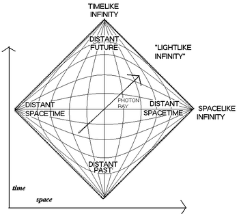

---

## World Line

一个质点的世界线就是它在所有时空位置组成的一条线。下面举一个例子：

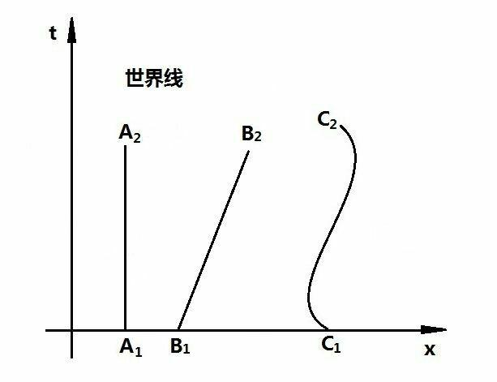

上图即为几个最简单的时空图。以C为例，由这条世界线的时空关系可以知道，质点的位置随时间呈现周期性的振动，可以知道这可能是一个以地面系为参考系的简谐振动的质点的世界线；但如果以质点作为参考系，那其时空图就只可能是y轴，因为在任何时空中，自身的位置都是0。

---

## World Line

世界线的概念，其本身并**不依赖于参考系**，它就是时空中的一条曲线。然而在参考系不确定的情况下，世界线的形状也是不确定的，在不同的坐标系下可能呈现不同的样子。因此，在时空图的研究中，参考系是一个前提。

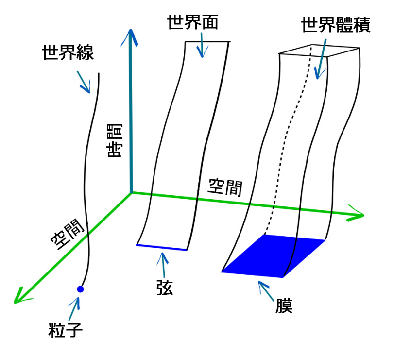

---

## World Line

下面我们介绍**光的世界线**。如果用秒来做时间轴的单位，用光秒来做空间轴的单位，那么光速表示为$c=1$，光的世界线在时空图上就是$x=t$和$x=-t$这两条直线，恰好是每个象限的平分线，而光的两条世界线所划定的蓝色区域，叫做**光锥**。

从图中可以很直观地看出，位于光锥内部的事件点A，与坐标原点时空间隔满足$s^2=t^2-x^2$。即从原点发出的光信号可以在事件A发生之前到达A的空间位置，所以事件A和坐标原点之间可以有因果联系，这样的时空间隔叫做类时间隔。

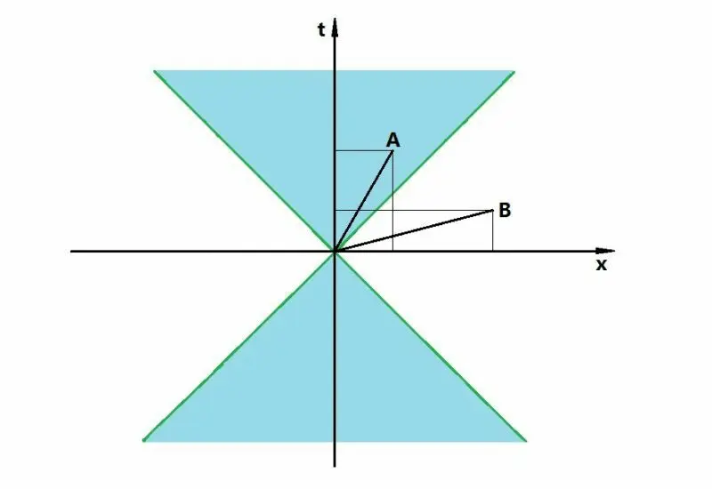

---

## World Line

类似地，事件B则完全相反，其与坐标原点之间不可能有因果联系，这样的时空间隔叫做类空间隔。

位于光的世界线上的事件，与坐标原点时空间隔的平方$s^2=t^2-x^2=0$。也就是从原点发出的光信号会恰好在该事件发生时到达该事件的空间位置，这样的时空间隔叫做类光间隔。

---

## World Line

那么时空图的原点是怎么定义的呢？事实上，时空图中的任意一个点都有它的光锥，可以用这个概念来描述一个事件未来和过去的关联事件。

以**future light cone**举例，当前事件所有的有可能有关联的事件都在future light cone中。光锥之外的事件不可能与当前事件有所联系。而**past light cone**正好相反。

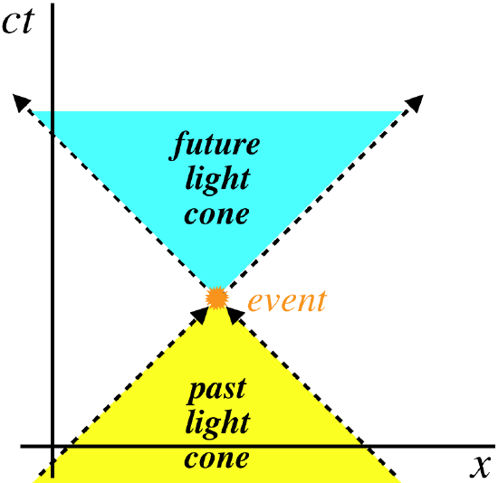

---

## Lorentz Transformation (Review)

根据相对论的基本假设，各个惯性系是**平权**的。为了更好地说明时空图所能表示的信息，我将对洛伦兹变换进行简单说明。

首先，假设惯性系$S'$相对于惯性系$S$以速度$v$沿着正方向移动。彭政老师的《力学》是我少数的学过的物理课，其中：

$$
\begin{align}
& x=\gamma\cdot(x'+vt')\\
& x'=\gamma'\cdot(x-vt)
\end{align}
$$

接下来，我们需要通过光速不变原理来得到$\gamma$的具体形式。因为在各自的参考系中有$x=ct;\ x'=ct'$，将上面的式子带入，可以得到$c^2tt'=\gamma^2tt'(c^2-v^2)$，解得$\gamma=\frac{c}{\sqrt{c^2-v^2}}$。整理可得洛伦兹变换：

$$
\begin{align}
& x'=\gamma(x-vt)\\
& t'=\gamma(t-\frac{vx}{c^2})
\end{align}
$$

---

## Transformation of Coordinates

既然时空图需要依靠参考系才能定义，那怎么对一个时空图进行坐标系的转换呢？:thinking:

现在让我们来研究一个地球与飞船的问题，如下图，图中飞船的时空坐标$(x,t)$表示在地球坐标系中飞船在$t$时刻所到达的空间位置为$x$。

下面我们将借助洛伦兹变换中得到的时空关系来给出坐标系的转换结果。

---

## Transformation of Coordinates

而在飞船坐标系中，无论飞船飞行了多久，其空间轴上的位置一直是0。所以，$x'=\frac{x-ut}{\sqrt{1-u^2/c^2}}$恒等于0，可知飞船坐标系的时间轴就是地球坐标系中$x=ut$这条直线，也是飞船相对于地球的世界线。

同理，令$t'=\frac{t-ux/c^2}{\sqrt{1-u^2/c^2}}$同样为0，可以得到飞船坐标系的空间轴即为$t=ux/c^2$。

当时间轴单位为秒，空间轴单位为光秒时，$c=1$，则可知$x'$与$t'$轴关于光的世界线对称，如右图所示。

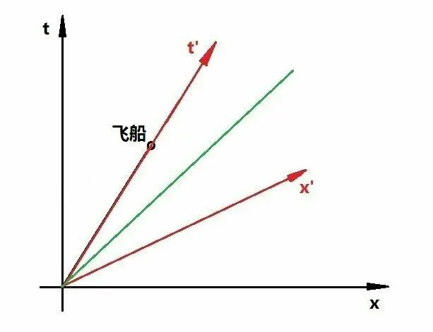

---

## Space-Time Interval

在惯性系中，两事件之间的间隔$\Delta s^2=-\Delta t^2+\Delta x^2$，其中由于时空图中的单位制的定义，$c=1$。这是二维时空中的间隔，调节$\Delta x^2$项，不难推广到更高维的时空中。

证明：间隔$\Delta s^2$是绝对的，在任意惯性系中都是不变的。假定有两个独立事件A, B。

$$
\begin{align}
 \Delta s'^2&=-\Delta t'^2+\Delta x'^2\\
& = (x'_B-x'_A)^2-(t'_B-t'_A)^2\\
& = \gamma^2(1-v^2)((x_B-x_A)^2-(t_B-t_A)^2)
\end{align}
$$

化简后可知$\Delta s'^2=\Delta s^2$，时空间隔在任意惯性系都是不变的。

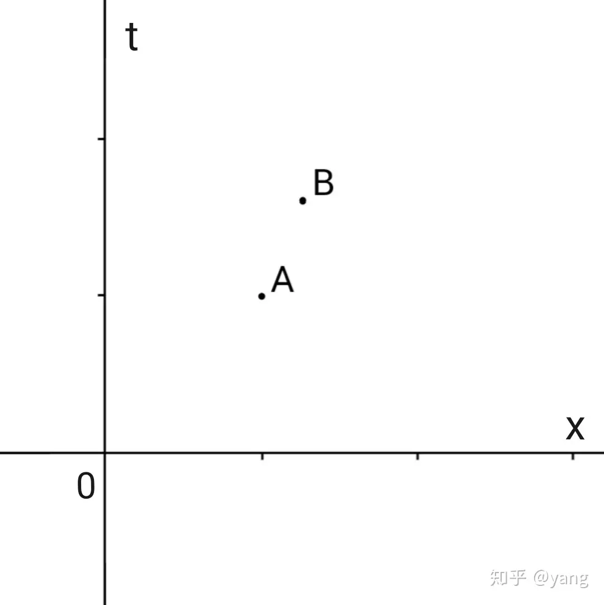

---

## Proper Time

固有时，顾名思义就是一个质点在自身参考系下的时间，类似时空间隔的定义，一个质点的固有时就是质点自身所经历的时间。一个质点的世界线上的任意两个事件$p_1$和$p_2$之间的固有时定义为：
$$
\tau=\int_{p_1}^{p_2}\sqrt{-ds^2}
$$

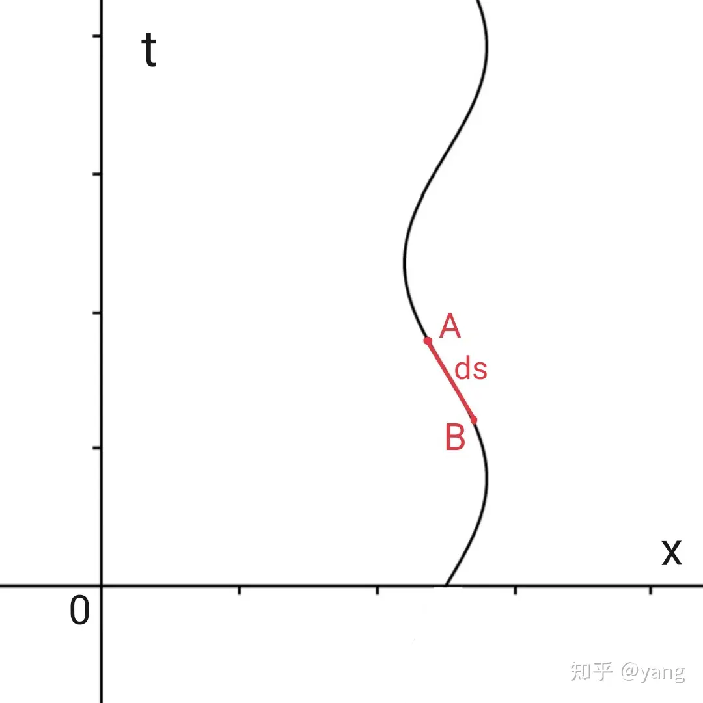
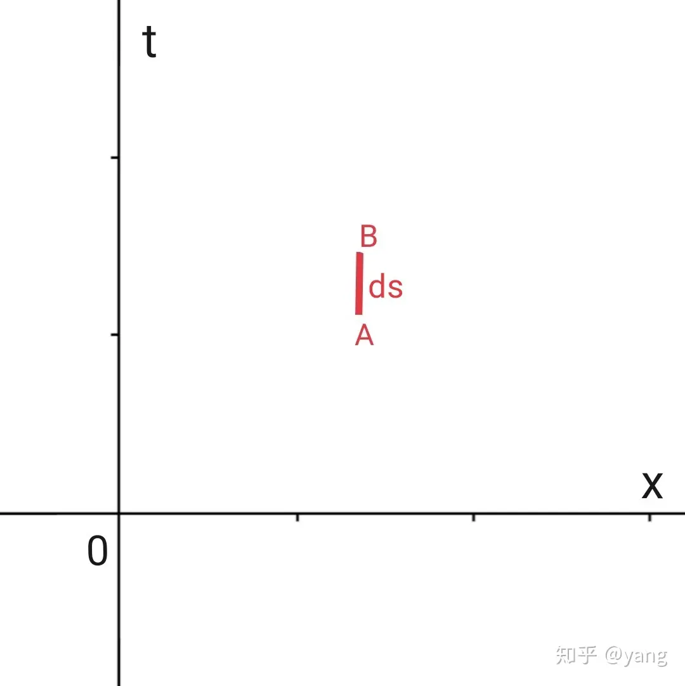

为了更好地理解固有时的概念，可以借助时空图：在世界线上的时空间隔可以经过某个参考系下的洛伦兹变换，作为原参考系下的绝对时间长度。那么很容易知道，对于任意一条世界线，如果我们对世界线的每一段积分，显然就得到了总的时间，也就是质点自己所经历的时间。

---

## Twin Paradox

下面，我们将介绍两种通过时空图解决双生子佯谬的方法。

### 第一种方法

首先我们定义地面系$(x,t)$和飞船系$(x',t')$，把两个坐标系画在同一张时空图上。对于任意一个事件A，我们可以在时空图中进行投影。

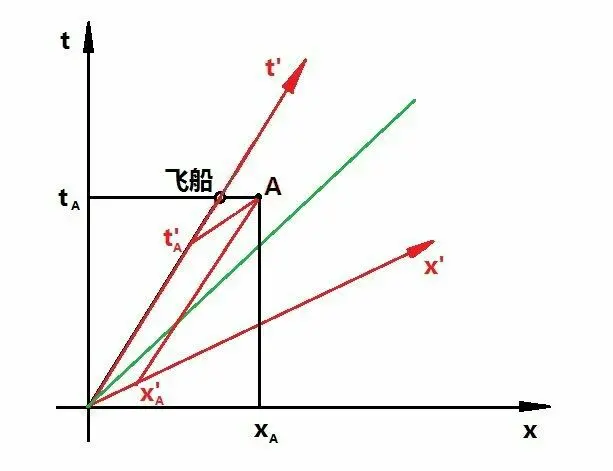

从图中可以看到，事件A在飞船系中发生事件早于飞船的当前时间，这直观反映了两个参考系的**同时性的丧失**。

那么，问题的答案是什么呢？:thinking:

---

### 第一种方法

假设飞船在F点调头，在R点返回地球。那么在掉头之前的瞬间，飞船上的人认为地球上的人处于P时刻；掉头之后的瞬间，认为地球上的人处于Q时刻。

那么，在掉头的过程中，地球上的人经历的时间为$OP+PQ+QR$，而飞船上的人经历的时间为$OF+FR$。设$OD=t_1$，$OF=t_1'$。根据时空间隔的定义，$OF=\sqrt{t_1^2-x_1^2}=t_1\sqrt{1-u^2}=t_1'$。可知，$t_1'<t_1$。

因此，飞船上的人更年轻。

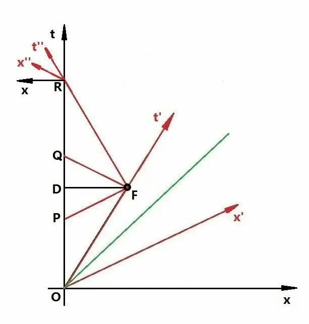

---

### 第二种方法

这种方法直接利用之前提到过的**固有时**的概念。

首先，我们可以画出双生子的世界线，如右图所示。

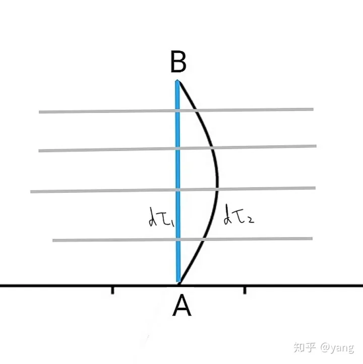

因为问题最终是比较双生子的年龄，因此我们只需要计算他们各自的固有时并比较即可：

$$
d\tau=\sqrt{-ds^2}=\sqrt{dt^2-dx^2}
$$

很明显每一段都有$d\tau_1>d\tau_2$。可知在地球上的人的总固有时大于飞船上的人的总固有时。

因此，飞船上的人更年轻。

---

<!-- _class: lead gaia -->

# Thanks!
应物T2101 韩耀辉
https://github.com/Han-0107/Marp_CSU
